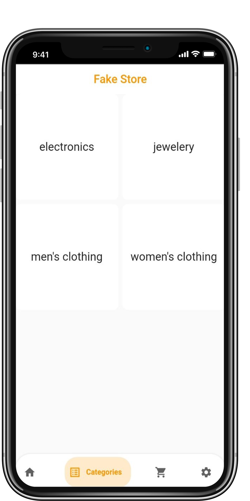
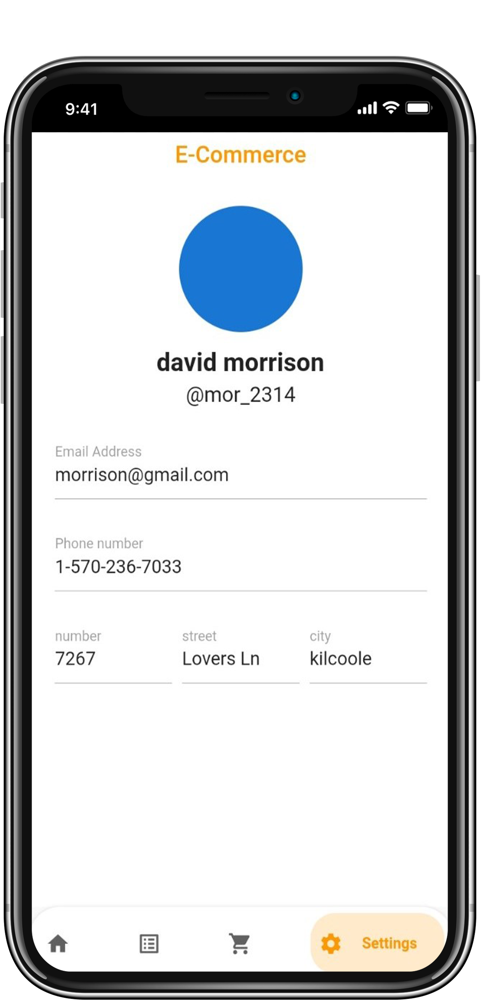
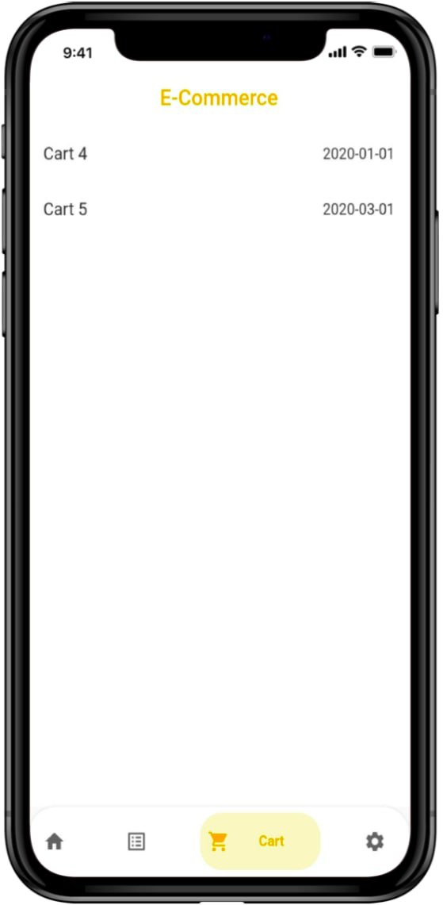
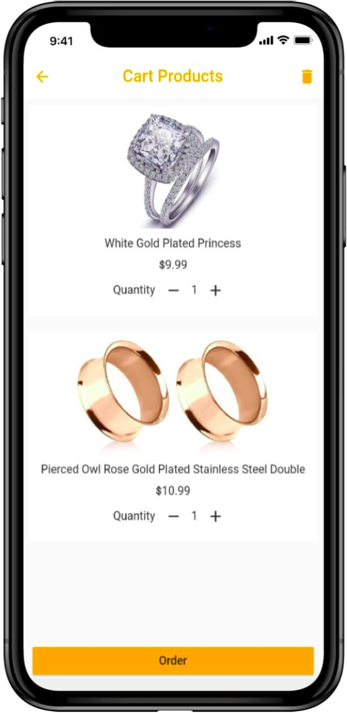

  <h3 align="center">E-Commerce app</h3>


<!-- ABOUT THE PROJECT -->
## About The Project

a basic e-commerce application that retrieves and shows products, allows users to manage carts and view user profiles


### Built With

* [Flutter](https://flutter.dev/)
* [Bloc State Management](https://pub.dev/packages/flutter_bloc)
* [Fake Store API](https://fakestoreapi.com/)


### Prerequisites

* Flutter V 3.3.3
* Dart V 2.18.2

### Installation

1. Clone the repo
   ```sh
   git clone https://github.com/DANIEL-DEMELASH/ecommerce.git
   ```
2. Install pubspec.yaml packages
   ```sh
   flutter pub get
   ```
3. Run `main.dart`
   ```sh
   flutter run';
   ```

## Screenshots

<table>
  <tr>
    <td>All Products Screen</td>
     <td>Category Screen</td>
     <td>Products By Category Screen</td>
  </tr>
  <tr>
    <td></td>
    <td></td>
    <td></td>
  </tr>
 </table>
 
 <table>
  <tr>
    <td>Product Detail Screen</td>
     <td>Cart Screen</td>
     <td>User Profile Screen</td>
  </tr>
  <tr>
    <td></td>    
    <td></td>
  </tr>
  <tr>
  <td></td>
  <td></td>
  </tr>
 </table>
 

<!-- CONTRIBUTING -->
## Contributing

If you have a suggestion that would make this better, please fork the repo and create a pull request. You can also simply open an issue with the tag "enhancement".
Don't forget to give the project a star! Thanks again!

1. Fork the Project
2. Create your Feature Branch (`git checkout -b feature/AmazingFeature`)
3. Commit your Changes (`git commit -m 'Add some AmazingFeature'`)
4. Push to the Branch (`git push origin feature/AmazingFeature`)
5. Open a Pull Request


<!-- CONTACT -->
## Contact

DANIEL DEMELASH - [@DANIELDEMELASH5](https://twitter.com/DANIELDEMELASH5%) - danieldemelash5@gmail.com

Project Link: [E-Commece](https://github.com/DANIEL-DEMELASH/ecommerce)


<!-- ACKNOWLEDGMENTS -->
## Acknowledgments

* [Choose an Open Source License](https://choosealicense.com)
* [GitHub Emoji Cheat Sheet](https://www.webpagefx.com/tools/emoji-cheat-sheet)
* [Malven's Flexbox Cheatsheet](https://flexbox.malven.co/)
* [Malven's Grid Cheatsheet](https://grid.malven.co/)
* [Img Shields](https://shields.io)
* [GitHub Pages](https://pages.github.com)
* [Font Awesome](https://fontawesome.com)
* [React Icons](https://react-icons.github.io/react-icons/search)


